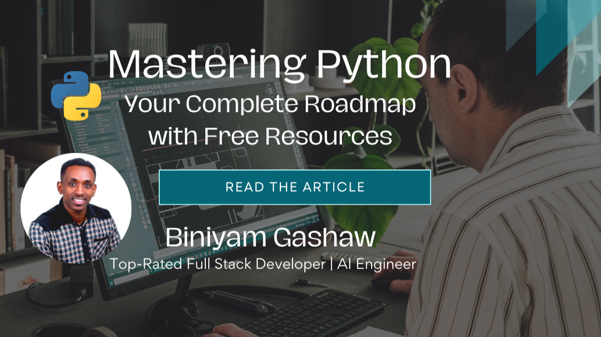

Python is celebrated for its simplicity, readability, and vast ecosystem, making it a top choice for beginners and experienced developers alike. Whether you’re starting from scratch or looking to advance your skills, mastering Python is a crucial step in your programming journey. This detailed roadmap will guide you through the essential stages of learning Python, packed with the best and most recent free resources available.

> Ultimately, the best resource is the one you stick with. It's tempting to jump around between courses, completing the first 10% each time, looking for the optimum learning tool. I highly recommend you pick one, try to finish at least half of it, and then reassess.

Research in educational psychology supports this, showing that consistency and persistence are key factors in effective learning. Studies indicate that learners who stick with a single course or resource are more likely to retain information and achieve their learning goals compared to those who frequently switch between resources (Ambrose et al., 2010).

**Ready to start on your Python journey? Let’s get started!**

## 1. Foundations of Python Programming

A strong foundation in Python sets the stage for everything else you’ll learn. Mastering the basics is essential before going into more advanced topics, ensuring you understand the core concepts that will be built upon in later stages.

### Key Topics:

- **Python Basics:** Learn the syntax, how to declare variables, and work with different data types.
- **Control Flow:** Understand loops, conditional statements, and how to control the flow of your programs.
- **Functions and Modules:** Learn to write reusable code using functions, and organize your code with modules.
- **Data Structures:** Explore lists, dictionaries, sets, and tuples to store and manage data effectively.
- **Object-Oriented Programming (OOP):** Grasp the fundamentals of classes, objects, inheritance, and polymorphism, which are key for writing scalable, maintainable code.
- **Modules and Packages:** Discover how to import and use Python libraries, enabling you to leverage existing tools and frameworks in your projects.

### Top Free Resources:

- **YouTube:** [Python for Everyone: From Zero to Hero 6 Hours Complete Course](https://www.youtube.com/watch?v=rfscVS0vtbw)
- **Interactive:** [Codecademy’s Python Course](https://www.codecademy.com/learn/learn-python-3)
- **Book:** [Automate the Boring Stuff with Python by Al Sweigart](https://automatetheboringstuff.com/)

### Pro Tip:

Apply what you’ve learned by building small projects, such as a basic calculator, a simple to-do list app, or even a password generator. These projects will help you understand how different concepts come together in real-world applications.

## 2. Object-Oriented Programming (OOP)

OOP is a programming paradigm that helps you organize your code into reusable, modular components. It’s particularly important for developing larger applications where managing code complexity is key.

### Key Topics:

- **Classes and Objects:** Learn how to define classes and create objects.
- **Inheritance:** Understand how to create new classes that inherit attributes and behaviors from existing classes.
- **Polymorphism:** Explore how objects of different classes can be treated as objects of a common superclass.
- **Encapsulation:** Bundle data and methods within one unit (class) and control their access.
- **Magic Methods and Operator Overloading:** Override Python’s built-in behavior using special methods like `__init__` and `__str__`.

### Top Free Resources:

- **YouTube:** [Python OOP Tutorial by Corey Schafer](https://www.youtube.com/playlist?list=PL-osiE80TeTsqhIuOqKhwlXsIBIdSeYtc)
- **Article:** [Understanding Python OOP by Real Python](https://realpython.com/python3-object-oriented-programming/)

### Pro Tip:

Refactor one of your existing Python scripts using OOP principles. Try building a simple class-based project like a library management system or a student database.

## 3. Advanced Python Topics

Advanced Python features like decorators, generators, and concurrency allow you to write more efficient, readable, and powerful code.

### Key Topics:

- **Decorators:** Modify the behavior of functions or classes using Python’s decorator syntax.
- **Generators:** Use generators to create memory-efficient iterators.
- **Context Managers:** Manage resources like file streams or database connections efficiently.
- **Concurrency:** Master Python’s concurrency features, including `asyncio`, threading, and multiprocessing.

### Top Free Resources:

- **YouTube:** [Intermediate Python Programming Course by Patrick Löber](https://youtu.be/HGOBQPFzWKo?si=aBPBnoac4OI-EUye)
- **Article:** [Decorators in Python by Real Python](https://realpython.com/courses/python-decorators-101/)
- **Interactive:** [Python Concurrency by Real Python](https://realpython.com/python-concurrency/)

## 4. Testing and Debugging

Writing tests and debugging are crucial for maintaining code quality and ensuring your programs work as expected.

### Key Topics:

- **Unit Testing:** Write unit tests using Python’s `unittest` module or `pytest`.
- **Debugging Techniques:** Identify and fix bugs using Python’s debugging tools like `pdb`.
- **Test-Driven Development (TDD):** Write tests before the actual code for more reliable and maintainable software.

### Top Free Resources:

- **YouTube:** [Python Testing with Pytest by Corey Schafer](https://www.youtube.com/watch?v=6tNS--WetLI)
- **Article:** [Debugging in Python by Real Python](https://realpython.com/python-debugging-pdb/)
- **YouTube:** [TDD Full Course by Wes Doyle](https://youtu.be/eAPmXQ0dC7Q)

## Specialization Opportunities

Once you’ve mastered the core concepts of Python, specialize in a field that aligns with your interests and career goals. Python offers a variety of paths, including:

- **Web Development:** Frameworks like Django and Flask.
- **Data Science:** Libraries like Pandas, NumPy, and Scikit-learn.
- **AI and Machine Learning:** TensorFlow, PyTorch, and other ML frameworks.
- **Automation:** Automate repetitive tasks with Python scripting.
- **DevOps and Cloud Computing:** Manage infrastructure and automate deployments using Python.

## Conclusion

Mastering Python is a journey that opens up countless opportunities, from web development and data science to automation and beyond. With the detailed roadmap and top-tier resources provided in this article, you’re well on your way to becoming proficient in Python.

> Remember, the key to mastering Python—or any programming language—is consistent practice and continuous learning. Take your time with each step, build projects that challenge you, and don’t hesitate to revisit topics as needed.

**Which part of the roadmap are you most excited about?** Let me know in the comments! And if you found this guide helpful, don’t forget to share it with your network. Let’s keep the learning going!
